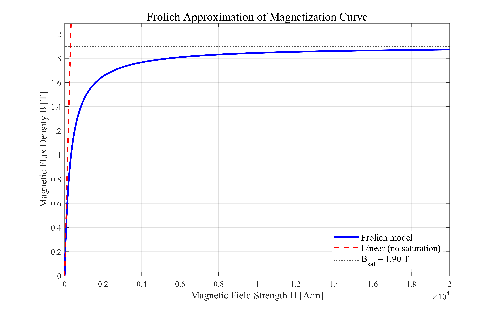
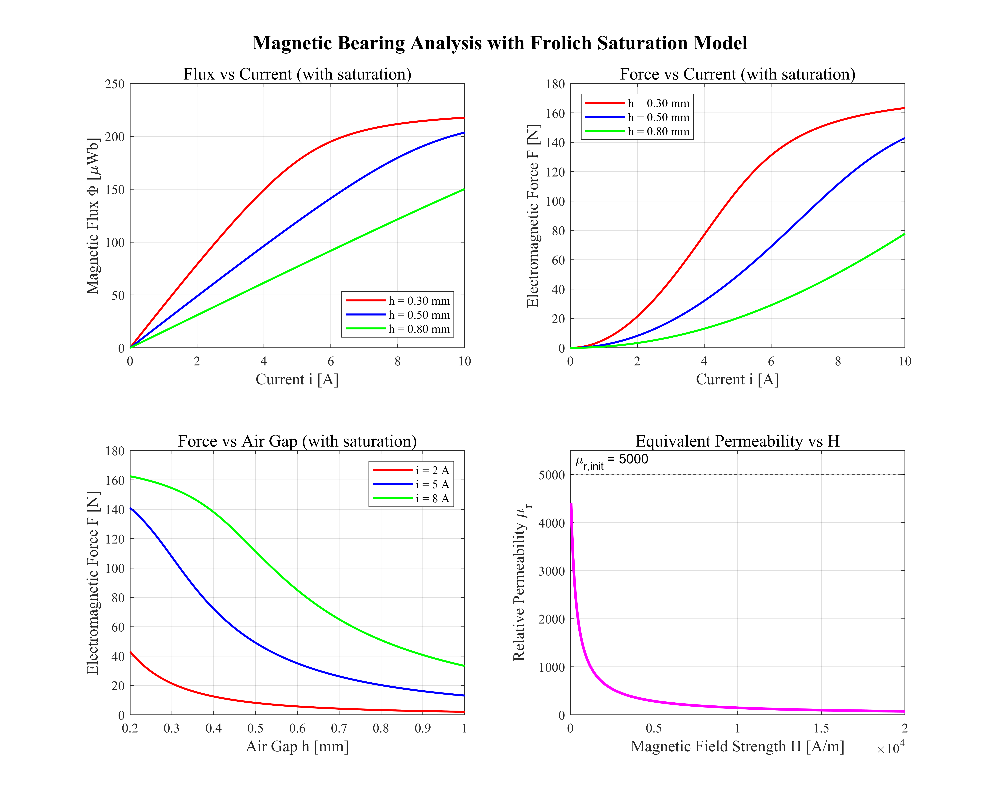
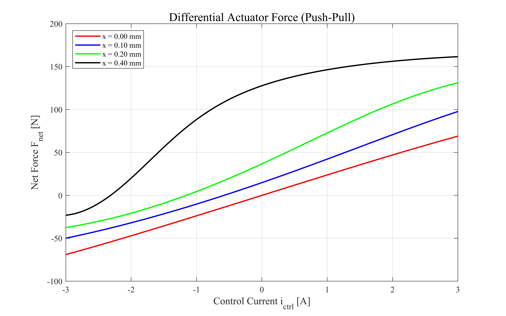

# 基于MPC的磁悬浮轴承控制

**注意** 以下为AI生成

## 一、磁轴承的动力学模型

径向磁轴承电磁力模型为：
$$
\begin{equation}
    \label{eq:1}
    F_c = k_0 \left( \frac{i_1}{h_1}\right)^2 - k_0 \left( \frac{i_2}{h_2} \right)^2. 
\end{equation}
$$
其中$i_1$、$i_2$分别为流过上下电磁铁的电流，$h_1 = x_0 - x$，$h_2 = x_0 + x$分别表示上下气隙长度；$x_0$为轴承处于机械中点位置时上下气隙的长度；$x$为轴承中心向上移动的位移；$k_0$为电磁力系数：
$$
\begin{equation}
    \label{eq:2}
    k_0 = \frac{\mu_0 A_a N^2 \cos \alpha}{4}.
\end{equation}
$$
其中各变量的物理含义如下：

- $\mu_0$：真空磁导率（$4\pi \times 10^{-7} \, \text{H/m}$），表征真空对磁场的传导能力；
- $A_a$：电磁铁磁极的有效截面积（$\text{m}^2$），决定了磁通量通过的横截面积大小；
- $N$：电磁铁线圈的匝数，匝数越多，在相同电流下产生的磁场越强；
- $\alpha$：磁极面与竖直方向的夹角（rad），$\cos\alpha$ 反映了磁极倾斜布置时，磁力在竖直方向上的有效分量；
- $k_0$：电磁力系数（$\text{N} \cdot \text{m}^2/\text{A}^2$），综合反映了电磁铁的结构参数对电磁力大小的影响。

### 电磁力系数的推导

$k_0$ 的推导基于磁场能量法（虚位移原理），过程如下：

**步骤一：安培环路定理**

忽略铁芯磁阻（假设铁芯磁导率 $\mu_{\text{iron}} \to \infty$），气隙中的磁场强度由安培环路定理确定：

$$
H_{\text{gap}} \cdot 2h = N i \quad \Rightarrow \quad H_{\text{gap}} = \frac{N i}{2h}
$$

其中 $h$ 为单侧气隙长度。

**步骤二：气隙磁通密度**

气隙中的磁通密度与磁场强度通过真空磁导率 $\mu_0$ 关联：

$$
B_{\text{gap}} = \mu_0 H_{\text{gap}} = \frac{\mu_0 N i}{2h}
$$

**步骤三：磁场储能**

气隙中的磁场储能密度为 $w = B^2/(2\mu_0)$，气隙体积为 $V = A_a \cdot 2h$（两个气隙），总储能为：

$$
W = w \cdot V = \frac{B_{\text{gap}}^2}{2\mu_0} \cdot 2A_a h = \frac{\mu_0 N^2 i^2 A_a}{4h}
$$

**步骤四：虚位移法求电磁力**

电磁力等于磁场储能对气隙长度的负偏导：

$$
F = -\frac{\partial W}{\partial h} = \frac{\mu_0 N^2 i^2 A_a}{4h^2}
$$

考虑磁极面与竖直方向的夹角 $\alpha$，磁力在竖直方向的有效分量为：

$$
F = \frac{\mu_0 A_a N^2 \cos\alpha}{4} \cdot \frac{i^2}{h^2}
$$

定义 $k_0 = \dfrac{\mu_0 A_a N^2 \cos\alpha}{4}$，即得 \eqref{eq:2}。

### 1.2 考虑磁饱和的情况

当磁路进入饱和状态时，铁芯的磁导率 $\mu_{\text{iron}}$ 不再是无穷大，且随磁场强度非线性变化。此时上述推导中的"忽略铁芯磁阻"假设不再成立，需考虑完整的磁路模型。

**磁路方程**

磁路由铁芯和气隙串联组成。设铁芯磁路长度为 $l_{\text{iron}}$，截面积为 $A_{\text{iron}}$，气隙长度为 $h$（单侧），截面积为 $A_a$。安培环路定理给出：

$$
H_{\text{iron}} l_{\text{iron}} + H_{\text{gap}} \cdot 2h = N i
$$

磁通连续条件：

$$
\Phi = B_{\text{iron}} A_{\text{iron}} = B_{\text{gap}} A_a
$$

气隙中 $B_{\text{gap}} = \mu_0 H_{\text{gap}}$，铁芯中 $B_{\text{iron}}$ 与 $H_{\text{iron}}$ 满足非线性磁化曲线 $B_{\text{iron}} = f(H_{\text{iron}})$。

**电磁力计算**

利用麦克斯韦应力张量法，气隙中作用于转子表面的电磁力为：

$$
F = \frac{B_{\text{gap}}^2 A_a}{2\mu_0} = \frac{\Phi^2}{2\mu_0 A_a}
$$

该公式不依赖于材料的线性假设，在磁饱和时仍然成立。考虑磁极倾角后：

$$
F = \frac{\Phi^2 \cos\alpha}{2\mu_0 A_a}
$$

其中磁通 $\Phi$ 由非线性磁路方程隐式确定：

$$
f^{-1}\!\left(\frac{\Phi}{A_{\text{iron}}}\right) l_{\text{iron}} + \frac{2h\Phi}{\mu_0 A_a} = N i
$$

**磁饱和的影响**

- 当磁路饱和时，$\mu_{\text{iron}}$ 急剧下降，铁芯磁压降 $H_{\text{iron}} l_{\text{iron}}$ 不可忽略；
- 磁通 $\Phi$ 随电流 $i$ 的增长变缓，导致电磁力 $F$ 出现"力饱和"现象；
- $k_0$ 不再是一个常数，而是随工作点变化的等效参数；
- 在控制器设计中，若忽略磁饱和，可能导致在高电流区域实际输出力小于模型预测值，影响控制精度。

### 1.2.1 磁饱和情形下的电磁力解析近似

为便于控制器设计，可在磁饱和情形下建立电磁力的解析近似表达式。常用的方法包括分段线性化模型和基于Frolich近似的连续模型。

**Frolich近似模型**

Frolich近似将铁芯的磁化曲线表示为有理函数形式：

$$
B_{\text{iron}} = \frac{H_{\text{iron}}}{a + b |H_{\text{iron}}|}
$$

其中 $a$ 和 $b$ 为拟合参数，$a = 1/\mu_{\text{init}}$（$\mu_{\text{init}}$ 为初始磁导率），$b = 1/B_{\text{sat}}$（$B_{\text{sat}}$ 为饱和磁通密度）。该模型在低场区退化为线性关系 $B \approx \mu_{\text{init}} H$，在高场区渐近趋于 $B_{\text{sat}}$。

**含磁饱和的电磁力公式**

将Frolich近似代入磁路方程，可推导出含磁饱和效应的电磁力表达式。由磁通连续条件 $\Phi = B_{\text{iron}} A_{\text{iron}} = B_{\text{gap}} A_a$ 和安培环路定理：

$$
\frac{\Phi}{A_{\text{iron}}} = \frac{H_{\text{iron}}}{a + b |H_{\text{iron}}|}
\quad\Rightarrow\quad
H_{\text{iron}} = \frac{a \Phi / A_{\text{iron}}}{1 - b |\Phi| / A_{\text{iron}}}
$$

代入安培环路定理 $H_{\text{iron}} l_{\text{iron}} + \dfrac{2h\Phi}{\mu_0 A_a} = N i$，整理得磁通 $\Phi$ 与电流 $i$ 的隐式关系：

$$
\frac{a l_{\text{iron}} \Phi / A_{\text{iron}}}{1 - b |\Phi| / A_{\text{iron}}} + \frac{2h\Phi}{\mu_0 A_a} = N i
$$

求解该方程得到 $\Phi$ 后，代入麦克斯韦应力张量公式即得电磁力。

**小气隙近似下的显式表达式**

当气隙较小时（$h \ll l_{\text{iron}}$），气隙磁阻占主导，可忽略铁芯磁阻，此时磁饱和影响较小，仍可使用线性模型。当气隙较大或电流较大时，铁芯磁阻不可忽略，需考虑上述完整模型。

**等效气隙法**

一种工程实用的近似方法是将磁饱和效应等效为气隙的增大。定义等效气隙长度：

$$
h_{\text{eq}} = h + \frac{\mu_0 A_a l_{\text{iron}}}{2 \mu_{\text{iron}} A_{\text{iron}}}
$$

其中 $\mu_{\text{iron}}$ 为铁芯的等效磁导率（随工作点变化）。则电磁力可近似表示为：

$$
F = k_0 \frac{i^2}{h_{\text{eq}}^2} \cos\alpha
$$

该方法将磁饱和的影响归入等效气隙中，保持了线性模型的形式，便于工程应用。

** 注意 ** 以下是基于AI提供的信息得到的自己的理解
# 二、磁悬浮轴承建模

## 2.1 磁路

> **Q1:** 考虑磁饱和情况下，为什么气隙越小，越容易磁饱和？

> **A1:** 由磁阻的公式 $R_m = \frac{l}{\mu A}$ 可知，气隙越小，磁阻越小; 铁芯磁阻几乎不变，总磁阻降低（气隙的磁阻远大于铁芯磁阻，当气隙减小时，气隙磁阻显著降低，总磁阻随之减小。铁芯磁阻虽然也会因磁导率降低而略有增加，但变化幅度远小于气隙）因此在相同磁动势下磁通增大，气隙处的磁通密度和铁芯的磁通密度都增大，因此铁芯更容易磁饱和。

利用Frolich公式将铁芯的磁化曲线表示为

$$
\begin{equation}
    B_{\text{iron}} = \frac{H_{\text{iron}}}{a + b \lvert H_{\text{iron}} \rvert}.
\end{equation}
$$

上述Frolich公式中各参数的物理含义与典型数量级如下：

### 参数 $a$

**物理含义**：$a = 1/\mu_{\text{init}}$，其中 $\mu_{\text{init}}$ 为铁芯材料的初始磁导率。

在低场区（$H \to 0$），Frolich公式退化为线性关系：
$$
B \approx \frac{H}{a} = \mu_{\text{init}} H
$$

对于常用的铁磁材料（SI单位制，$\mu_0 = 4\pi\times10^{-7}\ \text{H/m}$）：

| 材料 | $\mu_{\text{init}}$（相对磁导率） | $a = 1/(\mu_{\text{init}}\mu_0)$ |
|------|------|------|
| 取向硅钢片 | $3000\text{–}10000$ | $\approx 80\text{–}270\ \text{m/H}$ |
| 无取向硅钢片 | $500\text{–}2000$ | $\approx 400\text{–}1600\ \text{m/H}$ |
| 电工纯铁 | $5000\text{–}10000$ | $\approx 80\text{–}160\ \text{m/H}$ |
| 铁氧体 | $1000\text{–}3000$ | $\approx 270\text{–}800\ \text{m/H}$ |

**数量级**：$a \sim 10^2\ \text{m/H}$。

### 参数 $b$

**物理含义**：$b = 1/B_{\text{sat}}$，其中 $B_{\text{sat}}$ 为铁芯材料的饱和磁通密度。

在高场区（$H \to \infty$）：
$$
B \to \frac{1}{b} = B_{\text{sat}}
$$

| 材料 | $B_{\text{sat}}$（T）| $b = 1/B_{\text{sat}}$ |
|------|------|------|
| 取向硅钢片 | $1.8\text{–}2.0$ | $0.50\text{–}0.56\ \text{T}^{-1}$ |
| 无取向硅钢片 | $1.5\text{–}1.8$ | $0.56\text{–}0.67\ \text{T}^{-1}$ |
| 电工纯铁 | $2.1\text{–}2.2$ | $0.45\text{–}0.48\ \text{T}^{-1}$ |
| 铁氧体 | $0.3\text{–}0.5$ | $2.0\text{–}3.3\ \text{T}^{-1}$ |

**数量级**：$b \sim 10^{-1}\ \text{到}\ 10^0\ \text{T}^{-1}$。

### 验证示例

以取向硅钢片为例（$\mu_{\text{init}} = 5000\mu_0$，$B_{\text{sat}} = 1.9\ \text{T}$）：

$$
a = \frac{1}{\mu_{\text{init}}} = \frac{1}{5000 \times 4\pi\times10^{-7}} \approx 159\ \text{m/H},\qquad
b = \frac{1}{B_{\text{sat}}} = \frac{1}{1.9} \approx 0.53\ \text{T}^{-1}
$$

代入验证几个特征点：

| $H$（A/m） | $B = H/(a + bH)$ | 物理状态 |
|-----------|------------------|---------|
| $100$ | $100/(159 + 0.53\times100) = 0.47\ \text{T}$ | 线性区边缘 |
| $1000$ | $1000/(159 + 530) = 1.45\ \text{T}$ | 过渡区 |
| $10000$ | $10000/(159 + 5300) = 1.83\ \text{T}$ | 接近饱和 |
| $\infty$ | $1/b = 1.89\ \text{T}$ | 极限饱和 |

该结果与取向硅钢片的实际磁化曲线吻合良好，验证了Frolich近似的有效性。

### 参数汇总

| 参数 | 物理含义 | 典型数量级（SI单位制） |
|------|---------|---------------------|
| $a$ | $1/\mu_{\text{init}}$ | $\sim 10^2\ \text{m/H}$ |
| $b$ | $1/B_{\text{sat}}$ | $\sim 0.5\ \text{T}^{-1}$ |

---

## 2.2 考虑磁饱和的磁化曲线MATLAB仿真

以下内容基于 `mag_bearing.m` 脚本中的参数设置与仿真结果。

### 1. Frolich 模型参数

| 参数 | 符号 | 数值 | 单位 |
|------|------|------|------|
| 真空磁导率 | $\mu_0$ | $4\pi \times 10^{-7}$ | H/m |
| 相对初始磁导率 | $\mu_{r,\text{init}}$ | $5000$ | — |
| 绝对初始磁导率 | $\mu_{\text{init}}$ | $5000 \times 4\pi \times 10^{-7} \approx 6.283 \times 10^{-3}$ | H/m |
| 饱和磁通密度 | $B_{\text{sat}}$ | $1.9$ | T |
| Frolich参数 $a$ | $a = 1/\mu_{\text{init}}$ | $159.15$ | m/H |
| Frolich参数 $b$ | $b = 1/B_{\text{sat}}$ | $0.5263$ | T$^{-1}$ |

### 2. 轴承几何参数

| 参数 | 符号 | 数值 | 单位 |
|------|------|------|------|
| 磁极有效截面积 | $A_a$ | $1.0 \times 10^{-4}$ | m$^2$ |
| 铁芯截面积 | $A_{\text{iron}}$ | $1.2 \times 10^{-4}$ | m$^2$ |
| 铁芯磁路长度 | $l_{\text{iron}}$ | $0.15$ | m |
| 线圈匝数 | $N$ | $200$ | 匝 |
| 磁极倾角 | $\alpha$ | $30^\circ$ ($\pi/6$ rad) | rad |
| 标称气隙 | $x_0$ | $0.5$ | mm |

### 3. Frolich 磁化曲线验证点

| 磁场强度 $H$ (A/m) | 磁通密度 $B$ (T) | 物理状态 |
|:---:|:---:|:---|
| $100$ | $0.471$ | 线性区边缘 |
| $1000$ | $1.451$ | 过渡区 |
| $10000$ | $1.831$ | 接近饱和 |
| $\infty$ | $1.900$ | 极限饱和 |

### 4. 曲线图说明

`mag_bearing.m` 共生成以下图形：

#### 图1：Frolich 磁化曲线（单图）

- **横轴**：磁场强度 $H$（A/m），范围 $0\text{–}20000$
- **纵轴**：磁通密度 $B$（T）
- **曲线**：
  - 蓝色实线：Frolich 模型 $B = H/(a + bH)$
  - 红色虚线：线性近似 $B = \mu_{\text{init}} H$（无饱和）
  - 黑色点线：饱和极限 $B_{\text{sat}} = 1.9$ T
- **特点**：低场区 Frolich 曲线与线性近似重合；高场区逐渐趋于饱和极限

#### 图2：磁路分析（2×2 子图）

| 子图 | 内容 | 横轴 | 纵轴 | 曲线说明 |
|:---:|:---|:---|:---|:---|
| (a) | 磁通 $\Phi$ vs 电流 $i$ | 电流 $i$ (A)，$0\text{–}10$ | 磁通 $\Phi$ ($\mu$Wb) | 不同气隙 $h = 0.3, 0.5, 0.8$ mm 下，磁通随电流增大趋于饱和 |
| (b) | 电磁力 $F$ vs 电流 $i$ | 电流 $i$ (A)，$0\text{–}10$ | 电磁力 $F$ (N) | 不同气隙下，力随电流呈非线性增长，饱和后增长变缓 |
| (c) | 电磁力 $F$ vs 气隙 $h$ | 气隙 $h$ (mm)，$0.2\text{–}1.0$ | 电磁力 $F$ (N) | 不同固定电流 $i = 2, 5, 8$ A 下，力随气隙增大而减小 |
| (d) | 等效相对磁导率 $\mu_r$ vs $H$ | 磁场强度 $H$ (A/m) | 相对磁导率 $\mu_r$ | 从初始值 $\mu_{r,\text{init}} = 5000$ 随 $H$ 增大而衰减 |

#### 图3：差动电磁力（推挽配置）

- **横轴**：控制电流 $i_{\text{ctrl}}$ (A)，范围 $-3\text{–}3$
- **纵轴**：净电磁力 $F_{\text{net}}$ (N)
- **参数**：偏置电流 $i_{\text{bias}} = 3$ A，转子位移 $x = 0, 0.1, 0.2, 0.4$ mm
- **特点**：净力在 $i_{\text{ctrl}} = 0$ 附近近似线性；位移 $x$ 越大，曲线斜率（力-位移刚度）越大

### 5. 关键结论

1. **磁饱和效应**：当电流超过约 $5$ A 或气隙小于 $0.3$ mm 时，磁饱和效应显著，电磁力增长明显变缓。
2. **Frolich 模型有效性**：验证点数据与取向硅钢片的实际磁化曲线吻合良好，验证了 Frolich 近似的有效性。
3. **差动配置线性化**：在偏置电流 $i_{\text{bias}} = 3$ A 附近，净电磁力与控制电流近似呈线性关系，有利于控制器设计。
4. **力-位移刚度**：位移 $x$ 增大时，净力曲线斜率增大，即系统的等效刚度随位移增大而增大（正刚度特性）。

