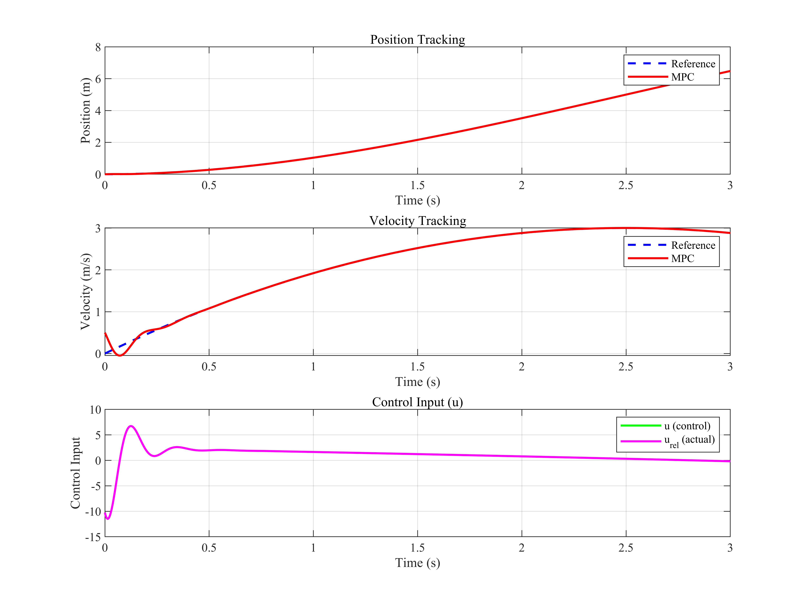
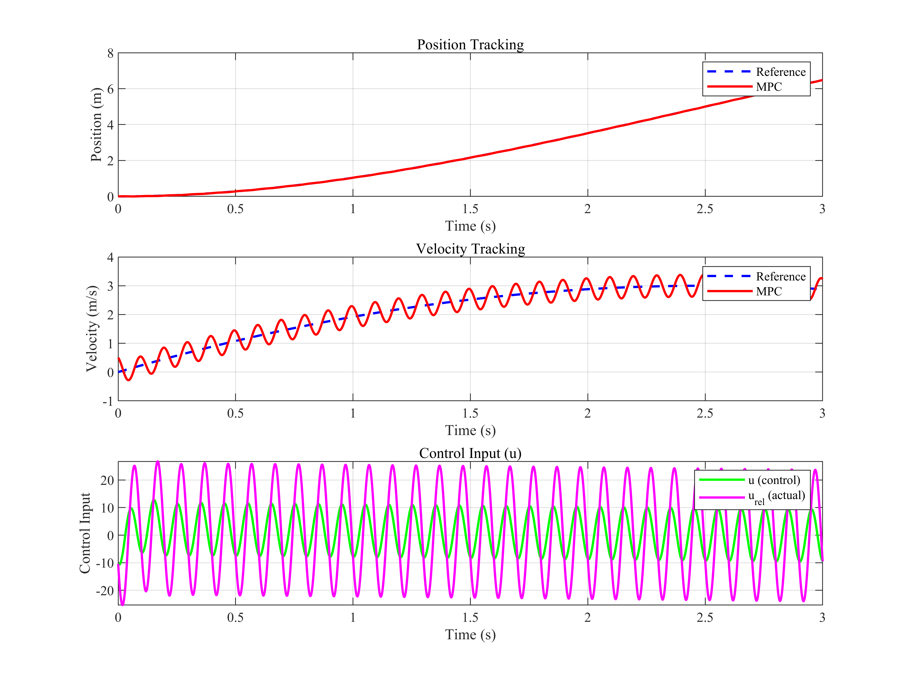
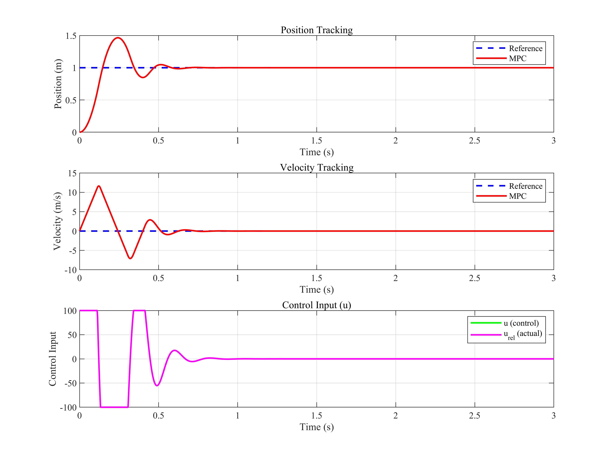
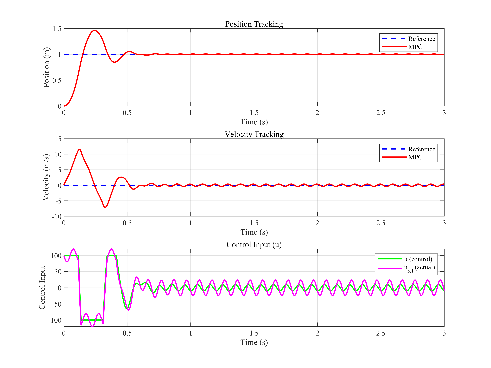
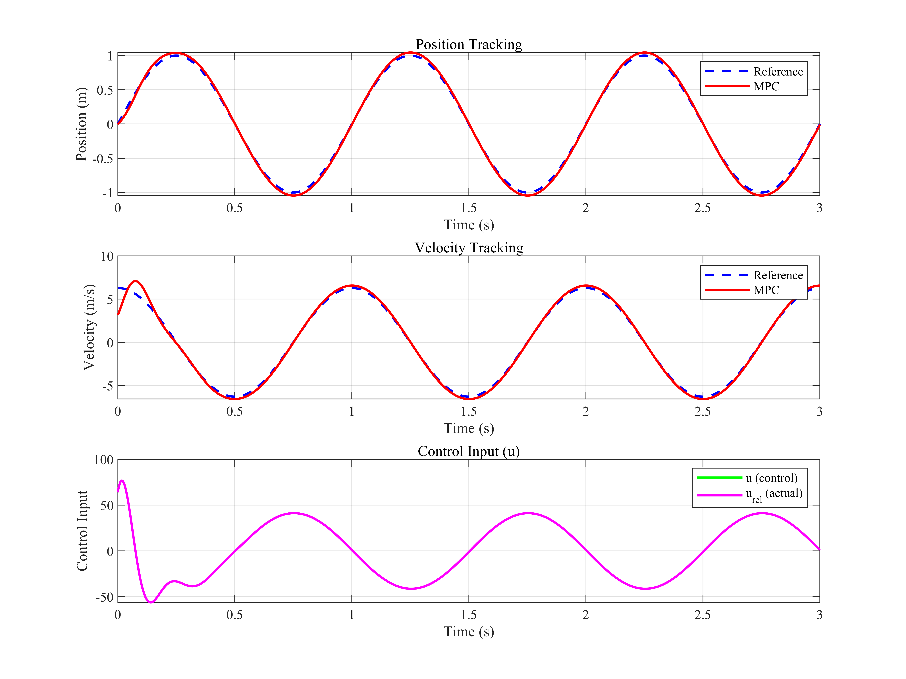
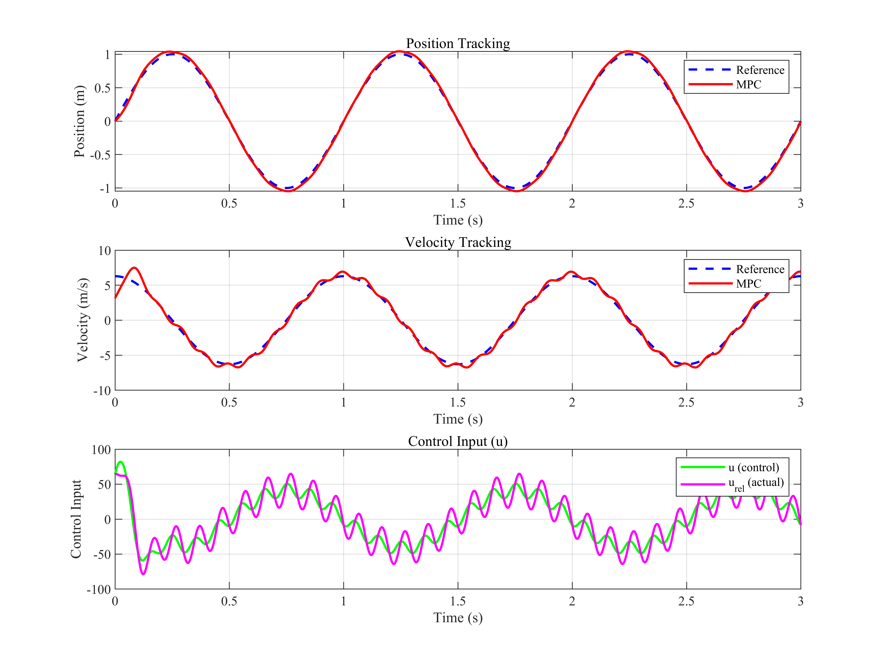

# 模型预测控制学习笔记

## 一、理论推导
刚性单质量体动力学模型如\eqref{eq:1}所示：
$$
\begin{equation}
    \label{eq:1}
    j\ddot{x} = t_e + k x - b\dot{x} - t_l.
\end{equation}
$$

$j$是系统惯量，$k$是刚度系数，$b$是粘滞阻尼系数，$t_l$是负载力。控制器的设计需求是根据给定初始状态$x_0$以及参考运动轨迹$x_{ref}$，设计$t_e$，使得$x$跟踪$x_{ref}$。其中需要满足约束：$|t_e| \le t_{max}$, $\dot{x} \le v_{max}$。

将\eqref{eq:1}写成状态方程的形式：
$$
\begin{equation}
    \label{eq:2}
    \left \{
    \begin{aligned}
        \dot{x_1} &= x_2 \\
        \dot{x_2} &= \frac{t_e}{j} + \frac{k}{j} x_1 - \frac{b}{j}x_2 - \frac{t_l}{j}.\\
    \end{aligned}
    \right.
\end{equation}
$$
其中$x_1 = x$，$x_2 = \dot{x}$。令$\mathbf{x} = [x_1, x_2] ^ T$，$u = \frac{T_e}{j}$, $d = -\frac{t_l}{j}$，$c = \frac{b}{j}$，$ s = \frac{k}{j}$，则状态方程可以写成:
$$
\begin{equation}
    \label{eq:3}
    \dot{\mathbf{x}} = \underbrace{\begin{bmatrix} 0 & 1 \\ s & -c \end{bmatrix}}_{\mathbf{A}}\mathbf{x} + \underbrace{\begin{bmatrix} 0 \\ 1 \end{bmatrix}}_{\mathbf{B}}\left(u + d\right).
\end{equation}
$$

利用前向欧拉法将\eqref{eq:3}离散化可得
$$
\begin{equation}
    \label{eq:4}
    \mathbf{x}[k+1] = \mathbf{A}_d \mathbf{x}[k] + \mathbf{B}_d \left(u + d\right).
\end{equation}
$$
其中，$\mathbf{A}_d = \mathbf{I} + \mathbf{A} T_s$，$\mathbf{B}_d = \mathbf{B} T_s$，$T_s$为采样时间。

假设初值为$\mathbf{x}[0] = [x_1[0], x_2[0]]$，$\mathbf{\hat{x}}[k]$为第$k$步的状态变量预测值。模型预测控制的精髓在于利用$\mathbf{x}[0]$和$u[0], u[1], \cdots, u[N-1]$，通过\eqref{eq:4}迭代计算$\mathbf{\hat{x}}[1], \mathbf{\hat{x}}[2], \cdots, \mathbf{\hat{x}}[N]$，其中$N$为预测步长。然后，通过优化算法求解最优控制序列。
$$
\begin{equation}
    \label{eq:5}
    \begin{aligned}
    \mathbf{\hat{x}}[1] &= \mathbf{A}_d \mathbf{x}[0] + \mathbf{B}_d \left(u[0] + w[0]\right)\\
    \mathbf{\hat{x}}[2] &= \mathbf{A}_d \mathbf{\hat{x}}[1] + \mathbf{B}_d \left(u[1] + w[1] \right)\\
    &= \mathbf{A}^2_d \mathbf{x}[0] + \mathbf{A}_d\mathbf{B}_d \left(u[0] + w[0]\right) + \mathbf{B}_d \left(u[1] + w[1] \right)\\
    & \cdots \\
    \mathbf{\hat{x}}[N] &= \mathbf{A}^{N}_d \mathbf{x}[0] + \sum\limits_{i=0}^{N-1} {\mathbf{A}^{i}_d \mathbf{B}_{d} \left(u[N - 1 - i] +  w[N - 1 - i] \right)}\\
    \end{aligned}
\end{equation}
$$

将\eqref{eq:5}写成矩阵形式：
$$
\begin{equation}
    \label{eq:6}
    \mathbf{\hat{X}} = \mathbf{M}_{x} \mathbf{x}[0] + \mathbf{M}_{ud} \left(\mathbf{U} + \mathbf{W}\right). \\
\end{equation}
$$
其中，$\mathbf{\hat{X}} = \left[\mathbf{\hat{x}}[1], \mathbf{\hat{x}}[2], \cdots, \mathbf{\hat{x}}[N] \right]^T, \mathbf{\hat{X}} \in \mathbb{R}_{2N \times 1}$; $\mathbf{U} = \left[u[0], u[1], \cdots, u[N-1] \right] ^ T, \mathbf{U} \in \mathbb{R}_{N \times 1}$; $\mathbf{W} = \left[w[0], w[1], \cdots, w[N-1] \right] ^ T, \mathbf{W} \in \mathbb{R}_{N \times 1}$;
$$
\begin{equation}
    \label{eq:7}
    \mathbf{M}_{x} = \left[\mathbf{A}_{d}, \mathbf{A}^{2}_{d}, \cdots, \mathbf{A}^{N}_{d} \right]^T, \mathbf{M}_{x} \in \mathbb{R}_{2N \times 2},
\end{equation}
$$
 
$$
\begin{equation}
    \label{eq:8}
    \mathbf{M}_{ud} = \begin{bmatrix}
        \mathbf{B}_{d} & 0 & \cdots & 0 \\
        \mathbf{A}_{d}\mathbf{B}_{d} & \mathbf{B}_{d} & \cdots & 0 \\
        \vdots & \vdots & \ddots & \vdots \\
        \mathbf{A}^{N-1}_{d}\mathbf{B}_{d} & \mathbf{A}^{N-2}_{d}\mathbf{B}_{d} & \cdots & \mathbf{B}_{d} \\
    \end{bmatrix}, \mathbf{M}_{u} \in \mathbb{R}_{2N \times N},
\end{equation}
$$

目标函数设计为：
$$
\begin{equation}
    \label{eq:9}
    J(\mathbf{U}) = \sum_{k=0}^{N-1} \left\| \mathbf{\hat{x}}[k+1] - \mathbf{x}_{r}[k+1] \right\|^2_{\mathbf{Q}} + \sum_{k=0}^{N-1} \left\| u[k] \right\|^2_{\mathbf{R}} + \sum_{k=1}^{N-2} \left\| u[k + 1] - u[k] \right\|^2_{\mathbf{S}},
\end{equation}
$$
其中，$\mathbf{X}_{r}$是参考轨迹, $\mathbf{X}_{r} \in \mathbb{R}_{2N \times 2}$, $\mathbf{x}_{r}$ 是其中的一个参考轨迹点；$\mathbf{Q} \in \mathbb{R}_{2 \times 2}$, $\mathbf{R} \in \mathbb{R}$, $\mathbf{S} \in \mathbb{R}$。

$$
\begin{equation}
\label{eq:10}
    J\left( \mathbf{U} \right) = \left( \mathbf{\hat{X}} - \mathbf{X}_r \right) ^ T
    \underbrace{
        \begin{bmatrix} 
            \mathbf{Q} & 0 & \cdots & 0 \\
            0 & \mathbf{Q} & \cdots & 0 \\
            \vdots & \vdots & \ddots & \vdots \\
            0 & 0 & \cdots & \mathbf{Q}
        \end{bmatrix}
    }_{\mathbf{\bar{Q}}_{2N \times 2N}}
    \left( \mathbf{\hat{X}} - \mathbf{X}_r \right) + 
    \mathbf{U}^T 
    \underbrace{
    \begin{bmatrix}
       \mathbf{R} & 0 & \cdots & 0 \\
        0 & \mathbf{R} & \cdots & 0 \\
        \vdots & \vdots & \ddots & \vdots \\
        0 & 0 & \cdots & \mathbf{R}
    \end{bmatrix}
    }_{\mathbf{\bar{R}_{N \times N}}}
    \mathbf{U} + 
    \mathbf{U}^T 
    \mathbf{D}^T
    \begin{bmatrix}
       \mathbf{S} & 0 & \cdots & 0 \\
        0 & \mathbf{S} & \cdots & 0 \\
        \vdots & \vdots & \ddots & \vdots \\
        0 & 0 & \cdots & \mathbf{S}
    \end{bmatrix}
    \mathbf{D}
    \mathbf{U}.
\end{equation}
$$
其中，$\mathbf{D}$ 是差分矩阵，$\mathbf{D} \in \mathbb{R}_{N-1 \times N}$，其定义为
$$
\begin{equation}
    \label{eq:11}
    \mathbf{D} = 
    \begin{bmatrix}
        1 & -1 & 0 & \cdots & 0 & 0\\
        0 & 1 & -1 & \cdots & 0 & 0\\
        \vdots & \vdots & \vdots & \ddots & \vdots & \vdots\\
        0 & 0 & 0 & \cdots & 1 & -1
    \end{bmatrix}.
\end{equation}
$$

将\eqref{eq:11}代入\eqref{eq:10}，化简后可得
$$
\begin{equation}
    \label{eq:12}
    J\left( \mathbf{U} \right) = \left( \mathbf{\hat{X}} - \mathbf{X}_r \right) ^ T
    \underbrace{
        \begin{bmatrix} 
            \mathbf{Q} & 0 & \cdots & 0 \\
            0 & \mathbf{Q} & \cdots & 0 \\
            \vdots & \vdots & \ddots & \vdots \\
            0 & 0 & \cdots & \mathbf{Q}
        \end{bmatrix}
    }_{\mathbf{\bar{Q}}_{2N \times 2N}}
    \left( \mathbf{\hat{X}} - \mathbf{X}_r \right) + 
    \mathbf{U}^T
    \underbrace{
        \begin{bmatrix}
        \mathbf{S + R} & -\mathbf{S} & 0 & \cdots & 0 \\
            -\mathbf{S} & \mathbf{2S + R} & -\mathbf{S} & \cdots & 0 \\
            \vdots & \ddots & \ddots & \ddots & \vdots \\
            0 & \cdots & \mathbf{-S} & \mathbf{2S + R} & \mathbf{-S} \\
            0 & 0 & \cdots & \mathbf{-S} & \mathbf{S + R} 
        \end{bmatrix}
    }_{\mathbf{\bar{S}}_{N \times N}}
    \mathbf{U}.
\end{equation}
$$

当且仅当$\mathbf{R} > \mathbf{S}\left( 2\cos \frac{\pi}{N+1} - 1 \right)$时，$\mathbf{\bar{S}}$为正定矩阵。

$$
\begin{equation}
    J\left( \mathbf{U} \right) =
    \left[ \mathbf{M}_x \mathbf{x}[0] + \mathbf{M}_{ud} \left(\mathbf{U} + \mathbf{W} \right)  - \mathbf{X}_r \right] ^ T \mathbf{\bar{Q}}
     \left[ \mathbf{M}_x \mathbf{x}[0] + \mathbf{M}_{ud} \left( \mathbf{U} + \mathbf{W} \right)  - \mathbf{X}_r \right] + \mathbf{U}^T \mathbf{\bar{S}} \mathbf{U}.
\end{equation}
$$

$$
\begin{equation}
    \label{eq:14}
    J\left( \mathbf{U} \right) = \left(\mathbf{U} + \mathbf{W} \right)^T \mathbf{H}
    \left(\mathbf{U} + \mathbf{W} \right) + \mathbf{f}^T \left(\mathbf{U} + \mathbf{W} \right) + \mathrm{const}.
\end{equation}
$$
其中
$$
\begin{equation}
    \label{eq:15}
        \left \{
        \begin{aligned}
            & \mathbf{H} = \mathbf{M}_{ud}^T \mathbf{\bar{Q}} \mathbf{M}_{ud} + \mathbf{\bar{S}} \\
            & \mathbf{f} = 2 \mathbf{M}_{ud}^T \mathbf{\bar{Q}} \left[ \mathbf{M}_x \mathbf{x}[0] - \mathbf{X}_r \right] \\
            & \mathrm{const} = \left[ \mathbf{M}_x \mathbf{x}[0]  - \mathbf{X}_r \right] ^ T \mathbf{\bar{Q}} \left[ \mathbf{M}_x \mathbf{x}[0]  - \mathbf{X}_r \right].
        \end{aligned}
        \right.
\end{equation}
$$

于是将MPC问题转换为求解约束QP问题。先不考虑扰动，$\mathbf{W} = \mathbf{0}$，约束条件为：
$$
\begin{equation}
    \label{eq:16}
    \begin{aligned}
        & \begin{bmatrix}
            I_N \\
            -I_N
        \end{bmatrix}
        \mathbf{U} < \begin{bmatrix}
            1_N \\
            1_N
        \end{bmatrix} u_{max}, \\
        & \mathbf{C}
        \mathbf{M}_{ud} \mathbf{U} < 
        \mathbf{C}
            1_{2N}
        v_{max} - 
        \mathbf{C} 
        \mathbf{M}_{x} \mathbf{x}[0] \\
        & -\mathbf{C}
        \mathbf{M}_{ud} \mathbf{U} < 
        \mathbf{C} 
            1_{2N}
        v_{max} + 
        \mathbf{C}
        \mathbf{M}_{x} \mathbf{x}[0]
    \end{aligned}
\end{equation}
$$
其中，$\mathbf{C}$为one-hot矩阵，用于选取偶数行，其表达式为：
$$
\begin{equation}
\label{eq:17}
    \mathbf{C} = \begin{bmatrix}
    0 & 1 & 0 & 0 & 0 & \cdots & 0 & 0 \\
    0 & 0 & 0 & 1 & 0 & \cdots & 0 & 0 \\
    \vdots & \vdots & \vdots & \vdots & \vdots & \ddots & \vdots & \vdots \\
    0 & 0 & 0 & 0 & 0 & \cdots & 0 & 1
    \end{bmatrix}, \mathbf{C} \in \mathbb{R}^{N \times 2N}.
\end{equation}
$$

## 二、MATLAB仿真

### 2.1 构造plant的状态空间方程
``` matlab
%% state space
format long;
k = 0;
b = 0.0001;
j = 0.001;
Ts = 0.0001;

s = k / j;
c = b / j;
A = [0 1; s -c];
B = [0; 1];
C = [1 0];
D = 0;

A_d = eye(2) + A * Ts;
B_d = B * Ts;
C_d = C;
D_d = D;

plant = ss(A_d, B_d, C_d, D_d, Ts);
```
### 2.2 构造MPC的H矩阵和f向量

``` matlab
%% construct M_x, M_ud, x_0, \bar Q, \bar S, H and f
N = 10; % horizon

M_x = [];
for i = 1:N     
    M_x = [M_x; A_d^i];
end

% Construct M_ud as a block lower-triangular Toeplitz matrix
% M_ud = [B_d      0       ...  0
%         A_d*B_d  B_d     ...  0
%         ...      ...     ...  ...
%         A_d^(N-1)*B_d  A_d^(N-2)*B_d  ...  B_d]
M_ud = [];
for i = 1:N
    row = [];
    for j = 1:N
        if i >= j
            row = [row, A_d^(i-j) * B_d];
        else
            row = [row, zeros(2, 1)];
        end
    end
    M_ud = [M_ud; row];
end

% Construct x_0
x_0 = [0; 0];

% Construct \bar Q
Q = [10000000 10; 10 100];
Q_bar = kron(eye(N), Q);

% Construct \bar R
R = 1e-2;
R_bar = kron(eye(N), R);

% Construct \bar S
S = 1e-4;
assert(R > S * (cos(pi / (N + 1)) - 1));

% Construct a N-1 x N differential Matrix
D = zeros(N - 1, N);
for i = 1:N-1
    for j = 1:N
        if i == j
            D(i, j) = 1;
        elseif j == i + 1
            D(i, j) = -1;
        end
    end
end

S_bar = kron(D'*D, S) + R_bar;

% Construct X_r
X_r = ones(2 * N, 1);

% Construct H
H = M_ud' * Q_bar * M_ud + S_bar;
H = (H + H') / 2;
f = 2 * M_ud' * Q_bar * (M_x * x_0 - X_r);
```

### 2.3 构造约束条件
``` matlab
u_max = 500;
v_max = 10;

a_1 = [eye(N); -1 * eye(N)];
b_1 = [ones(N, 1); ones(N,1)] * u_max;

C = zeros(N, 2*N);
for i = 1:N
    for j = 1:2*N
        if j == 2*i
            C(i, j) = 1;
        end
    end
end

a_2 = C * M_ud;
b_2 = C * ones(2*N, 1) * v_max - C * M_x * x_0;

a_3 = -C * M_ud;
b_3 = C * ones(2*N, 1) * v_max + C * M_x * x_0;

a = [a_1; a_2; a_3];
b = [b_1; b_2; b_3];
```
### 2.4 求解约束QP问题，并通过quadprog滚动优化得到最优控制序列
``` matlab
%% solve constrain QP
mode = 'step';
disturb = false;

step_num = 3e4;
time = 0:1:step_num-1+10;
time = time * Ts;

% 轨迹参数
P_end = 10;     % 终点位置 (m)
T_total = 5;    % 总运动时间 (s)

p1 = -2 * P_end / T_total^3;
p2 = 3 * P_end / T_total^2;

switch mode
    case 'poly'
        x_0 = [0; 0.5];
        x_r = p1 * time.^3 + p2 * time.^2;
        x_r_dot = 3 * p1 * time.^2 + 2 * p2 * time;
    case 'sin'
        x_0 = [0; 1 * pi];
        x_r = 1 * sin(2 * pi * time);
        x_r_dot = 2 * pi * cos(2 * pi * time);
    case 'step'
        x_0 = [0; 0];
        x_r = 1 * ones(1, length(time));   % step from 0 to 1 at t=0
        x_r_dot = zeros(1, length(time));  % zero velocity reference
    otherwise
        error('Unknown mode: %s', mode);
end

X_r = [x_r; x_r_dot];

options = optimoptions('quadprog', 'Display', 'off', ...
                       'Algorithm', 'interior-point-convex', ...
                       'MaxIterations', 100);

warm = [];

% 重塑参考轨迹为矩阵
X_r_mat = reshape(X_r, 2, []);   % 2行：位置，速度

% 预分配记录
X_record = zeros(length(x_0), step_num);
u_record = zeros(1,step_num);
u_rel_record = zeros(1,step_num);

% ---------- 离线计算 ----------
M_udQ = M_ud' * Q_bar;

% ---------- 在线循环 ----------
x_cur = x_0;
for i = 1:step_num
    % 提取当前及未来 N 步参考
    ref_window = X_r_mat(:, i:i+N-1);
    ref_vec = ref_window(:);   % 列向量
    
    % 计算梯度
    f = 2 * M_udQ * (M_x * x_cur - ref_vec);
    
    % 更新约束
    b_2 = C * ones(2*N, 1) * v_max - C * M_x * x_cur;
    b_3 = C * ones(2*N, 1) * v_max + C * M_x * x_cur;
    b = [b_1; b_2; b_3];

    % 求解 QP
    [u, ~, exitflag] = quadprog(H, f, a, b, [], [], [], [], u, options);
    
    warm = u;   % 热启动
    
    % 系统更新
    if(disturb)
        x_next = A_d * x_cur + B_d * (u(1:1)  - 20 * sin(Ts * i * 2 * pi * 10));
    else
        x_next = A_d * x_cur + B_d * u(1:1);
    end
    X_record(:, i) = x_next;
    u_record(:, i) = u(1:1);
    if(disturb)
        u_rel_record(:,i) = u(1:1)  - 20 * sin(Ts * i * 2 * pi * 10);
    else
        u_rel_record(:,i) = u(1:1);
    end
    x_cur = x_next;
end
```

### 2.5 绘制结果
``` matlab
set(0, 'DefaultAxesFontName', 'Times New Roman');
set(0, 'DefaultTextFontName', 'Times New Roman');

figure('Position', [100, 100, 800, 600]);

subplot(3, 1, 1);
plot(time(1:step_num), X_r(1, 1:step_num), 'b--', 'LineWidth', 1.5); hold on;
plot(time(1:step_num), X_record(1, :), 'r-', 'LineWidth', 1.5);
xlabel('Time (s)', 'FontName', 'Times New Roman');
ylabel('Position (m)', 'FontName', 'Times New Roman');
legend('Reference', 'MPC', 'FontName', 'Times New Roman');
title('Position Tracking', 'FontName', 'Times New Roman');
grid on;

subplot(3, 1, 2);
plot(time(1:step_num), X_r(2, 1:step_num), 'b--', 'LineWidth', 1.5); hold on;
plot(time(1:step_num), X_record(2, :), 'r-', 'LineWidth', 1.5);
xlabel('Time (s)', 'FontName', 'Times New Roman');
ylabel('Velocity (m/s)', 'FontName', 'Times New Roman');
legend('Reference', 'MPC', 'FontName', 'Times New Roman');
title('Velocity Tracking', 'FontName', 'Times New Roman');
grid on;

subplot(3, 1, 3);
plot(time(1:step_num), u_record, 'g-', 'LineWidth', 1.5); hold on;
plot(time(1:step_num), u_rel_record, 'm-', 'LineWidth', 1.5);
xlabel('Time (s)', 'FontName', 'Times New Roman');
ylabel('Control Input', 'FontName', 'Times New Roman');
legend('u (control)', 'u_{rel} (actual)', 'FontName', 'Times New Roman');
title('Control Input (u)', 'FontName', 'Times New Roman');
grid on;
```

{#fig:mpc1}

{#fig:mpc2}

{#fig:mpc3}

{#fig:mpc4}

{#fig:mpc5}

{#fig:mpc6}